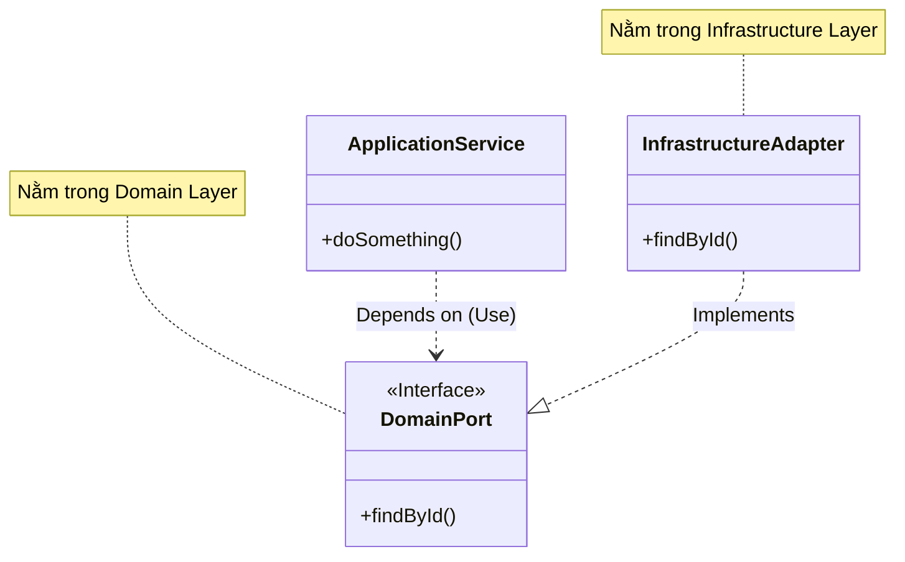

# 🔌 Interface + Adapter Pattern (Port & Adapter)

Tài liệu này mô tả chi tiết cách áp dụng **Interface + Adapter Pattern** (hay Port & Adapter / Hexagonal Architecture) để giao tiếp giữa các modules trong dự án.

Mục tiêu chính là **giảm sự phụ thuộc (decoupling)** giữa các module và chuẩn bị sẵn sàng cho việc **chuyển đổi sang Microservices** mà không cần sửa đổi business logic.

---

## 🏗️ 1. Nguyên lý kiến trúc

Trong DDD và Hexagonal Architecture, quy tắc quan trọng nhất là **Dependency Rule**:

> **Dependencies luôn hướng vào trong (Domain Layer). Domain Layer không phụ thuộc vào bất kỳ layer bên ngoài nào.**

Khi Module A (Payment) cần gọi Module B (User):
- ❌ **Sai (Direct Dependency)**: Payment Service gọi trực tiếp User Service/Repository.
- ✅ **Đúng (Inversion of Control)**: Payment Service gọi qua một **Interface (Port)** được định nghĩa ngay trong Payment Domain.

### Dependency Inversion Principle (DIP)



---

## 📂 2. Cấu trúc thư mục

Để tuân thủ DIP, chúng ta tổ chức các file như sau:

```text
src/modules/payment/
├── domain/                  # 🔴 DOMAIN LAYER (Ổn định nhất)
│   ├── ports/               # ✅ PORTS: Interfaces giao tiếp ra ngoài
│   │   ├── external-user.port.ts
│   │   └── index.ts
│
├── application/             # 🟡 APPLICATION LAYER
│   └── service/
│       └── payment.service.impl.ts  # ✅ Import Port từ Domain
│
├── infrastructure/          # 🟢 INFRASTRUCTURE LAYER (Dễ thay đổi)
│   └── external/            # ✅ ADAPTERS: Implementations của Ports
│       ├── user-repository.local-adapter.ts
│       ├── user-repository.http-adapter.ts
│       └── index.ts
```

| Component | Layer | Vị trí | Trách nhiệm |
|-----------|-------|--------|-------------|
| **Port (Interface)** | Domain | `domain/ports/` | Định nghĩa contract ("Tôi cần data gì?"). Thuộc về Consumer. |
| **Adapter (Impl)** | Infrastructure | `infrastructure/external/` | Thực hiện lấy data (DB call, HTTP call, gRPC...). |
| **Consumer** | Application | `application/service/` | Sử dụng Port để lấy data. |

---

## 🛠️ 3. Hướng dẫn Implement chi tiết

### Bước 1: Định nghĩa Port (Interface) trong Domain

Tạo file `domain/ports/external-user.port.ts`. Đây là **Anti-Corruption Layer**, chỉ định nghĩa những field mà Domain của bạn thực sự cần.

```typescript
// src/modules/payment/domain/ports/external-user.port.ts
import { Result } from '../../../../shared/domain/result';

export interface ExternalUserData {
  id: string;
  email: string;
  name: string;
}

// Token cho Dependency Injection
export const EXTERNAL_USER_PORT = Symbol('EXTERNAL_USER_PORT');

export interface IExternalUserPort {
  findById(id: string): Promise<Result<ExternalUserData>>;
  exists(id: string): Promise<boolean>;
}
```

### Bước 2: Implement Local Adapter (Monolith)

Trong môi trường Monolith, Adapter này sẽ gọi trực tiếp Repository của module khác.

```typescript
// src/modules/payment/infrastructure/external/user-repository.local-adapter.ts
import { Injectable, Inject } from '@nestjs/common';
import { IExternalUserPort, ExternalUserData } from '../../domain/ports';
import { UserRepository } from '../../../user/domain/repository/user.repository';

@Injectable()
export class UserRepositoryLocalAdapter implements IExternalUserPort {
  constructor(
    @Inject(UserRepository)
    private readonly userRepository: UserRepository, // Direct coupling ok here
  ) {}

  async findById(id: string): Promise<Result<ExternalUserData>> {
    const user = await this.userRepository.findById(id);
    if (!user) return Result.fail(new Error('User not found'));
    
    // Map to ACL Interface
    return Result.ok({
      id: user.id,
      email: user.email,
      name: user.name,
    });
  }
}
```

### Bước 3: Implement HTTP Adapter (Microservices - Optional)

Khi tách service, ta tạo thêm HTTP Adapter để gọi API.

```typescript
// src/modules/payment/infrastructure/external/user-repository.http-adapter.ts
import { Injectable } from '@nestjs/common';
import { IExternalUserPort, ExternalUserData } from '../../domain/ports';

@Injectable()
export class UserRepositoryHttpAdapter implements IExternalUserPort {
  async findById(id: string): Promise<Result<ExternalUserData>> {
    // Gọi HTTP Request sang User Service
    const response = await fetch(`http://user-service/users/${id}`);
    const data = await response.json();
    return Result.ok(data);
  }
}
```

### Bước 4: Đăng ký trong Module (Wiring)

Tại `payment.module.ts`, ta bind Interface với Adapter cụ thể.

```typescript
// src/modules/payment/payment.module.ts
import { EXTERNAL_USER_PORT } from './domain/ports';
import { UserRepositoryLocalAdapter } from './infrastructure/external';

@Module({
  imports: [UserModule], // Chỉ cần khi dùng LocalAdapter
  providers: [
    {
      provide: EXTERNAL_USER_PORT,
      useClass: UserRepositoryLocalAdapter, // ✨ Switch adapter here!
    },
  ],
})
export class PaymentModule {}
```

### Bước 5: Sử dụng trong Application Service

Inject Interface vao Service. Service **hoàn toàn không biết** data đến từ đâu (DB trực tiếp hay API).

```typescript
// src/modules/payment/application/service/payment.service.impl.ts
import { EXTERNAL_USER_PORT, IExternalUserPort } from '../../domain/ports';

@Injectable()
export class PaymentServiceImpl implements PaymentService {
  constructor(
    @Inject(EXTERNAL_USER_PORT)
    private readonly externalUserPort: IExternalUserPort,
  ) {}

  async createPayment(input: CreatePaymentInput) {
    // Gọi qua Interface -> Tuân thủ DIP
    const user = await this.externalUserPort.findById(input.userId);
    // ...
  }
}
```

---

## 🔄 4. Chiến lược chuyển đổi (Migration Strategy)

Mô hình này giúp việc chuyển từ Monolith sang Microservices cực kỳ dễ dàng:

### Giai đoạn 1: Monolith (Hiện tại)
- **Adapter**: `UserRepositoryLocalAdapter`
- **Cơ chế**: Gọi trực tiếp function của Module khác.
- **Ưu điểm**: Performance cao, transaction dễ xử lý.

### Giai đoạn 2: Tách Microservices
Khi tách User Module thành service riêng:
1. Copy code Payment Module sang repo mới (hoặc giữ nguyên nếu build độc lập).
2. Xóa `import { UserModule }` trong `PaymentModule`.
3. Đổi implementation trong `providers`:
   ```typescript
   {
     provide: EXTERNAL_USER_PORT,
     useClass: UserRepositoryHttpAdapter, // ✨ Chỉ sửa dòng này
   }
   ```
4. **Business Logic (Domain/Application layer) KHÔNG HỀ THAY ĐỔI.**

---

## ✅ Checklist kiểm tra

- [ ] **Port Interface** có nằm trong `domain/ports` không?
- [ ] **Port** có độc lập với framework/database implementation không?
- [ ] **Application Service** chỉ import Port, KHÔNG import Adapter?
- [ ] **Adapter** có nằm trong `infrastructure/external` không?
- [ ] **DIP**: Application -> Domain <- Infrastructure?
