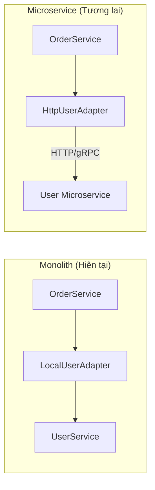

# NestJS Technical Best Practices & Guidelines

Tài liệu này quy định các tiêu chuẩn kỹ thuật bắt buộc (Mandatory) cho toàn bộ đội ngũ phát triển NestJS/TypeScript. Mục tiêu là đảm bảo chất lượng code đồng nhất, an toàn kiểu dữ liệu (Type Safety), hiệu năng cao và dễ dàng bảo trì theo triết lý **Clean Code**.

## 1. Cấu trúc Dự án & Đặt tên (Project Layout & Naming)

### 1.1. Quy tắc đặt tên File và Folder
File và folder sử dụng **kebab-case**, kèm hậu tố theo vai trò (`.service`, `.controller`, `.module`, `.dto`, `.entity`, `.repository`, `.guard`, `.interceptor`, `.filter`).

```typescript
// ❌ Incorrect
userRepository.ts       // camelCase
AuthService.ts          // PascalCase
create_order_dto.ts     // snake_case

// ✅ Correct
user.repository.ts
auth.service.ts
create-order.dto.ts
order.entity.ts
jwt-auth.guard.ts
```

### 1.2. Đặt tên Class & Interface
*   **Class**: PascalCase, hậu tố phản ánh vai trò.
*   **Interface**: PascalCase, **không** tiền tố `I`.
*   **Enum**: PascalCase, giá trị UPPER_SNAKE_CASE.

```typescript
// ❌ Incorrect
export interface IUserService {}    // Tiền tố 'I'
export class userService {}         // Không PascalCase
export enum status { active }       // Không PascalCase

// ✅ Correct
export interface UserService {}
export class UserServiceImpl {}
export enum OrderStatus {
  PENDING = 'PENDING',
  COMPLETED = 'COMPLETED',
}
```

### 1.3. Cấu trúc Module chuẩn
Mỗi feature module nên tuân theo cấu trúc như sau:

```text
src/modules/order/
├── dto/
│   ├── create-order.dto.ts
│   └── update-order.dto.ts
├── entities/
│   └── order.entity.ts
├── order.controller.ts
├── order.service.ts
├── order.repository.ts
├── order.module.ts
└── order.constants.ts
```

---

## 2. Clean Code & Architecture

### 2.1. Dependency Injection (DI)
Luôn sử dụng **Constructor Injection**. Tuyệt đối không dùng `new` để khởi tạo service/repository bên trong lớp khác.

```typescript
// ❌ Incorrect: Hard dependency, không test được
@Injectable()
export class OrderService {
  private userRepo = new UserRepository(); // Tự khởi tạo
  
  async createOrder(dto: CreateOrderDto) {
    const user = await this.userRepo.findById(dto.userId);
  }
}

// ✅ Correct: Inject qua Constructor
@Injectable()
export class OrderService {
  constructor(
    private readonly userRepo: UserRepository,
    private readonly paymentService: PaymentService,
  ) {}

  async createOrder(dto: CreateOrderDto) {
    const user = await this.userRepo.findById(dto.userId);
  }
}
```

### 2.2. Interface Segregation (Phụ thuộc vào Abstraction)
Khi Service cần phụ thuộc vào thành phần bên ngoài (third-party, external API), hãy **định nghĩa Interface/Abstract class** và inject qua token. Điều này giúp dễ dàng mock trong unit test và thay thế implementation.

```typescript
// ❌ Incorrect: Phụ thuộc trực tiếp vào implementation cụ thể
@Injectable()
export class NotificationService {
  private client = new FirebaseAdmin(); // Không thể mock

  async send(userId: string, message: string) {
    await this.client.messaging().send({ /* ... */ });
  }
}

// ✅ Correct: Định nghĩa abstract class + inject token
// notification.port.ts
export abstract class NotificationPort {
  abstract send(userId: string, message: string): Promise<void>;
}

// firebase-notification.adapter.ts
@Injectable()
export class FirebaseNotificationAdapter extends NotificationPort {
  async send(userId: string, message: string): Promise<void> {
    // Firebase implementation
  }
}

// notification.module.ts
@Module({
  providers: [
    {
      provide: NotificationPort,
      useClass: FirebaseNotificationAdapter,
    },
  ],
  exports: [NotificationPort],
})
export class NotificationModule {}
```

### 2.3. Hạn chế Magic Numbers & Strings
Mọi giá trị cố định phải được khai báo thành **constants** hoặc **enum**.

```typescript
// ❌ Incorrect
if (user.role === 'admin') { /* ... */ }
if (retryCount > 5) { /* ... */ }

// ✅ Correct
export enum UserRole {
  ADMIN = 'admin',
  MEMBER = 'member',
}
const MAX_RETRIES = 5;

if (user.role === UserRole.ADMIN) { /* ... */ }
if (retryCount > MAX_RETRIES) { /* ... */ }
```

### 2.4. Single Responsibility Principle (SRP) cho Service
Mỗi Service chỉ xử lý logic nghiệp vụ của **một domain duy nhất**. Tuyệt đối không nhồi nhét logic của nhiều domain vào một Service.

```typescript
// ❌ Incorrect: OrderService tự xử lý payment, email, inventory
@Injectable()
export class OrderService {
  async createOrder(dto: CreateOrderDto) {
    // ... tạo order
    await this.chargePayment(dto.amount);   // ❌ Logic payment
    await this.sendEmail(dto.userEmail);     // ❌ Logic email
    await this.reduceStock(dto.productId);   // ❌ Logic inventory
  }
}

// ✅ Correct: Chia nhỏ thành các Service riêng, phối hợp qua DI
@Injectable()
export class OrderService {
  constructor(
    private readonly paymentService: PaymentService,
    private readonly mailService: MailService,
    private readonly inventoryService: InventoryService,
  ) {}

  async createOrder(dto: CreateOrderDto) {
    const order = await this.orderRepo.create(dto);
    await this.paymentService.charge(order.amount);
    await this.inventoryService.reduceStock(order.productId);
    await this.mailService.sendOrderConfirmation(order);
    return order;
  }
}
```

---

## 3. Xử lý Lỗi (Error Handling)

### 3.1. Fail Fast & Guard Clauses
Tránh nesting quá sâu bằng cách return/throw sớm.

```typescript
// ❌ Incorrect: Nesting 3+ levels
async processOrder(userId: string, orderId: string) {
  const user = await this.userRepo.findById(userId);
  if (user) {
    if (user.isActive) {
      const order = await this.orderRepo.findById(orderId);
      if (order) {
        // ... logic chính
      } else {
        throw new NotFoundException('Order not found');
      }
    } else {
      throw new ForbiddenException('User is inactive');
    }
  } else {
    throw new NotFoundException('User not found');
  }
}

// ✅ Correct: Guard clauses, flat code
async processOrder(userId: string, orderId: string) {
  const user = await this.userRepo.findById(userId);
  if (!user) throw new NotFoundException('User not found');
  if (!user.isActive) throw new ForbiddenException('User is inactive');

  const order = await this.orderRepo.findById(orderId);
  if (!order) throw new NotFoundException('Order not found');

  // Logic chính nằm ở indent thấp nhất
}
```

### 3.2. Custom Business Exception
Định nghĩa lớp `BusinessException` để Service layer trả về mã lỗi tường minh. Service **BẮT BUỘC** không được throw trực tiếp các HTTP Exception (`BadRequestException`, `NotFoundException`...) — đó là trách nhiệm của tầng Transport.

```typescript
// common/exceptions/business.exception.ts
export class BusinessException extends Error {
  constructor(
    public readonly code: string,
    message: string,
    public readonly details?: Record<string, any>,
  ) {
    super(message);
    this.name = 'BusinessException';
  }
}

// domain/error-codes.ts — Khai báo tập trung tất cả mã lỗi
export const ERR = {
  USER_NOT_FOUND:      new BusinessException('USER_NOT_FOUND', 'User does not exist'),
  EMAIL_ALREADY_EXISTS: new BusinessException('EMAIL_ALREADY_EXISTS', 'Email is already registered'),
  BALANCE_NOT_ENOUGH:  new BusinessException('BALANCE_NOT_ENOUGH', 'Insufficient balance'),
  ORDER_ALREADY_PAID:  new BusinessException('ORDER_ALREADY_PAID', 'This order has been paid'),
} as const;
```

```typescript
// ❌ Incorrect: Service throw HTTP exception (coupling với HTTP layer)
@Injectable()
export class UserService {
  async findById(id: string): Promise<User> {
    const user = await this.repo.findOne({ where: { id } });
    if (!user) {
      throw new NotFoundException(`User ${id} not found`); // ❌ HTTP concern
    }
    return user;
  }
}

// ✅ Correct: Service throw BusinessException với mã lỗi rõ ràng
@Injectable()
export class UserService {
  async findById(id: string): Promise<User> {
    const user = await this.repo.findOne({ where: { id } });
    if (!user) {
      throw new BusinessException('USER_NOT_FOUND', `User ${id} not found`);
    }
    return user;
  }
}
```

### 3.3. Global Exception Filter (Error Mapping Layer)
Tạo Filter toàn cục để **tự động map** `BusinessException` sang HTTP Status Code. Controller không cần try/catch thủ công.

```typescript
// common/filters/business-exception.filter.ts
@Catch(BusinessException)
export class BusinessExceptionFilter implements ExceptionFilter {
  // Map mã lỗi → HTTP Status Code
  private readonly statusMap: Record<string, HttpStatus> = {
    USER_NOT_FOUND:       HttpStatus.NOT_FOUND,
    EMAIL_ALREADY_EXISTS: HttpStatus.CONFLICT,
    BALANCE_NOT_ENOUGH:   HttpStatus.UNPROCESSABLE_ENTITY,
    ORDER_ALREADY_PAID:   HttpStatus.UNPROCESSABLE_ENTITY,
  };

  catch(exception: BusinessException, host: ArgumentsHost) {
    const ctx = host.switchToHttp();
    const response = ctx.getResponse();
    const status = this.statusMap[exception.code] || HttpStatus.INTERNAL_SERVER_ERROR;

    response.status(status).json({
      code: exception.code,
      message: exception.message,
      details: exception.details || null,
    });
  }
}

// main.ts — Đăng ký Global Filter
app.useGlobalFilters(new BusinessExceptionFilter());
```

Kết quả: Controller trở nên **cực kỳ sạch**:

```typescript
// ✅ Controller không cần try/catch, filter tự động xử lý
@Controller('orders')
export class OrderController {
  constructor(private readonly orderService: OrderService) {}

  @Post()
  async create(@Body() dto: CreateOrderDto) {
    return this.orderService.create(dto);
    // Nếu service throw BusinessException → Filter tự động trả JSON lỗi chuẩn
  }
}
```

---

## 4. Xử lý Bất đồng bộ (Asynchronous)

### 4.1. Luôn `await` — Tránh Floating Promises
Gọi hàm async mà thiếu `await` sẽ khiến lỗi bị nuốt (swallowed) và logic chạy sai thứ tự.

```typescript
// ❌ Incorrect: Lỗi bị nuốt, không biết update có thành công không
async updateUser(id: string, data: UpdateUserDto) {
  this.userRepo.update(id, data);  // Thiếu await!
  this.logger.log('User updated');  // Log trước khi update xong
}

// ✅ Correct
async updateUser(id: string, data: UpdateUserDto) {
  await this.userRepo.update(id, data);
  this.logger.log('User updated');
}
```

### 4.2. Song song hóa với `Promise.all`
Khi nhiều tác vụ **không phụ thuộc lẫn nhau**, chạy song song thay vì tuần tự.

```typescript
// ❌ Incorrect: Chạy tuần tự → chậm (tổng = t1 + t2 + t3)
const user = await this.userService.findById(userId);
const orders = await this.orderService.findByUser(userId);
const notifications = await this.notifService.findByUser(userId);

// ✅ Correct: Chạy song song → nhanh (tổng = max(t1, t2, t3))
const [user, orders, notifications] = await Promise.all([
  this.userService.findById(userId),
  this.orderService.findByUser(userId),
  this.notifService.findByUser(userId),
]);
```

### 4.3. Timeout cho External Calls
Mọi HTTP call ra bên ngoài **BẮT BUỘC** phải có timeout để tránh treo request.

```typescript
// ❌ Incorrect: Không timeout → request có thể treo vĩnh viễn
const response = await this.httpService.axiosRef.get('https://external-api.com/data');

// ✅ Correct: Luôn set timeout
const response = await this.httpService.axiosRef.get('https://external-api.com/data', {
  timeout: 5000, // 5 giây
  signal: AbortSignal.timeout(5000), // Hoặc dùng AbortSignal
});
```

---

## 5. Hiệu suất (Performance)

### 5.1. DTO & Validation Pipeline
Sử dụng `class-validator` và `class-transformer`. Luôn bật `whitelist: true` và `forbidNonWhitelisted: true` để chặn field không mong muốn (ngăn Mass Assignment attack).

```typescript
// main.ts — Cấu hình global
app.useGlobalPipes(
  new ValidationPipe({
    whitelist: true,              // Tự động strip field thừa
    forbidNonWhitelisted: true,   // Throw error nếu có field lạ
    transform: true,              // Tự động transform type (string → number)
  }),
);

// dto/create-order.dto.ts
export class CreateOrderDto {
  @IsString()
  @IsNotEmpty()
  productId: string;

  @IsNumber()
  @Min(1)
  quantity: number;

  @IsOptional()
  @IsString()
  note?: string;
}
```

### 5.2. Tránh N+1 Query (Query trong Loop)
Tuyệt đối không query database bên trong vòng lặp.

```typescript
// ❌ Incorrect: N+1 Query — 1 query lấy orders + N query lấy từng user
const orders = await this.orderRepo.find();
for (const order of orders) {
  order.user = await this.userRepo.findById(order.userId); // ❌ Query trong loop
}

// ✅ Correct: 2 queries tổng cộng
const orders = await this.orderRepo.find();
const userIds = [...new Set(orders.map((o) => o.userId))];
const users = await this.userRepo.findByIds(userIds); // 1 query IN(...)
const userMap = new Map(users.map((u) => [u.id, u]));

for (const order of orders) {
  order.user = userMap.get(order.userId);
}

// ✅ Hoặc dùng TypeORM relations
const orders = await this.orderRepo.find({ relations: ['user'] });
```

### 5.3. Pagination bắt buộc
Mọi API trả về danh sách **BẮT BUỘC** phải có pagination. Không bao giờ trả về toàn bộ bảng.

```typescript
// ❌ Incorrect: Trả toàn bộ → crash nếu bảng có triệu records
async findAll() {
  return this.repo.find();
}

// ✅ Correct: Luôn có pagination
async findAll(page = 1, limit = 20) {
  const [data, total] = await this.repo.findAndCount({
    skip: (page - 1) * limit,
    take: limit,
    order: { createdAt: 'DESC' },
  });

  return {
    data,
    meta: { page, limit, total, totalPages: Math.ceil(total / limit) },
  };
}
```

---

## 6. Logging (Structured Logging)

### 6.1. Sử dụng NestJS Logger qua DI
Tuyệt đối không dùng `console.log` trong production code.

```typescript
// ❌ Incorrect
console.log('User created:', user.id);
console.error('Error:', err);

// ✅ Correct: Inject Logger vào Service
import { Logger } from '@nestjs/common';

@Injectable()
export class OrderService {
  private readonly logger = new Logger(OrderService.name);

  async create(dto: CreateOrderDto) {
    this.logger.log(`Creating order for product ${dto.productId}`);

    try {
      const order = await this.orderRepo.save(dto);
      this.logger.log(`Order created successfully`, { orderId: order.id });
      return order;
    } catch (err) {
      this.logger.error('Failed to create order', err.stack, {
        productId: dto.productId,
        error: err.message,
      });
      throw err;
    }
  }
}
```

### 6.2. Không Log Dữ liệu Nhạy cảm
Tuyệt đối không log password, token, credit card, PII (Personally Identifiable Information).

```typescript
// ❌ Incorrect
this.logger.log('Login attempt', { email, password }); // ❌ Lộ password

// ✅ Correct
this.logger.log('Login attempt', { email });
```

---

## 7. Testing

### 7.1. Table-Driven Tests
Sử dụng `it.each` cho các hàm có nhiều case input/output.

```typescript
describe('PriceCalculator', () => {
  it.each([
    { quantity: 1, price: 100, discount: 0, expected: 100 },
    { quantity: 2, price: 100, discount: 10, expected: 180 },
    { quantity: 0, price: 100, discount: 0, expected: 0 },
  ])('calculates total for $quantity items at $price with $discount% off', ({ quantity, price, discount, expected }) => {
    expect(calculateTotal(quantity, price, discount)).toBe(expected);
  });
});
```

### 7.2. Service Unit Test với Mock
Luôn mock các dependency của Service. Không gọi database/API thật trong unit test.

```typescript
describe('UserService', () => {
  let service: UserService;
  let mockRepo: jest.Mocked<UserRepository>;

  beforeEach(async () => {
    const module = await Test.createTestingModule({
      providers: [
        UserService,
        {
          provide: UserRepository,
          useValue: {
            findOne: jest.fn(),
            save: jest.fn(),
          },
        },
      ],
    }).compile();

    service = module.get(UserService);
    mockRepo = module.get(UserRepository);
  });

  it('should throw BusinessException when user not found', async () => {
    mockRepo.findOne.mockResolvedValue(null);

    await expect(service.findById('non-existent'))
      .rejects
      .toThrow(BusinessException);
  });

  it('should return user when found', async () => {
    const mockUser = { id: '1', name: 'John' } as User;
    mockRepo.findOne.mockResolvedValue(mockUser);

    const result = await service.findById('1');
    expect(result).toEqual(mockUser);
    expect(mockRepo.findOne).toHaveBeenCalledWith({ where: { id: '1' } });
  });
});
```

---

## 8. Configuration (12-Factor App)

### 8.1. Environment Variables với `@nestjs/config`
Cấu hình phải được load từ **Environment Variables**. Sử dụng `ConfigModule` để validate và strongly-type config.

```typescript
// config/app.config.ts — Validate env khi app khởi động
import { IsNumber, IsString, IsEnum } from 'class-validator';
import { plainToInstance, Transform } from 'class-transformer';

export class AppConfig {
  @IsNumber()
  @Transform(({ value }) => parseInt(value, 10))
  PORT: number;

  @IsString()
  DATABASE_URL: string;

  @IsString()
  JWT_SECRET: string;

  @IsEnum(['development', 'staging', 'production'])
  NODE_ENV: string;
}

// app.module.ts
@Module({
  imports: [
    ConfigModule.forRoot({
      isGlobal: true,
      validate: (config) => {
        const validated = plainToInstance(AppConfig, config);
        const errors = validateSync(validated);
        if (errors.length > 0) {
          throw new Error(`Config validation error: ${errors}`);
        }
        return validated;
      },
    }),
  ],
})
export class AppModule {}
```

### 8.2. Không Hardcode Credentials
Tuyệt đối không hardcode bất kỳ secret/credential/API key nào trong code.

```typescript
// ❌ Incorrect
const JWT_SECRET = 'my-super-secret-key-123'; // ❌ Hardcode

// ✅ Correct
constructor(private readonly configService: ConfigService) {}

getJwtSecret(): string {
  return this.configService.getOrThrow<string>('JWT_SECRET');
}
```

---

## 9. Security

### 9.1. Guards cho Authentication & Authorization
Sử dụng Guards để kiểm soát truy cập. Tuyệt đối không kiểm tra auth bên trong hàm controller/service.

```typescript
// ❌ Incorrect: Check auth thủ công trong controller
@Get('profile')
async getProfile(@Req() req: Request) {
  const token = req.headers.authorization;
  if (!token) throw new UnauthorizedException();
  const user = this.authService.verify(token);  // ❌ Logic auth trong controller
  return user;
}

// ✅ Correct: Guard tách biệt, decorator rõ ràng
@UseGuards(JwtAuthGuard)
@Get('profile')
async getProfile(@CurrentUser() user: User) {
  return user;
}
```

### 9.2. Rate Limiting
API public **BẮT BUỘC** phải có rate limiting để chống brute-force và DDoS.

```typescript
// app.module.ts
import { ThrottlerModule } from '@nestjs/throttler';

@Module({
  imports: [
    ThrottlerModule.forRoot({
      throttlers: [
        { name: 'short', ttl: 1000, limit: 3 },   // Max 3 req/giây
        { name: 'long', ttl: 60000, limit: 60 },  // Max 60 req/phút
      ],
    }),
  ],
})
export class AppModule {}
```

### 9.3. Helmet & CORS
Luôn bật Helmet để thêm các HTTP security headers và cấu hình CORS chặt chẽ.

```typescript
// main.ts
import helmet from 'helmet';

app.use(helmet());
app.enableCors({
  origin: configService.get('ALLOWED_ORIGINS')?.split(',') || [],
  methods: ['GET', 'POST', 'PUT', 'PATCH', 'DELETE'],
  credentials: true,
});
```

### 9.4. Sanitize Input
Ngoài validation, cần sanitize dữ liệu đầu vào để chống XSS/SQL Injection.

```typescript
// ❌ Incorrect: Dùng raw input trực tiếp vào query
const users = await this.repo.query(`SELECT * FROM users WHERE name = '${name}'`);

// ✅ Correct: Dùng parameterized query (TypeORM tự handle)
const users = await this.repo.find({ where: { name } });

// ✅ Correct: Nếu cần raw query
const users = await this.repo.query('SELECT * FROM users WHERE name = $1', [name]);
```

---

## 10. Data Structures & Serialization

### 10.1. DTO cho Input, Entity cho Database
Tuyệt đối **không** dùng Entity trực tiếp làm response. Luôn có DTO/ViewModel để kiểm soát dữ liệu trả về.

```typescript
// ❌ Incorrect: Trả entity trực tiếp → lộ password, internal fields
@Get(':id')
async getUser(@Param('id') id: string) {
  return this.userRepo.findOne({ where: { id } }); // ❌ Lộ password, createdAt internal...
}

// ✅ Correct: Map sang Response DTO
// dto/user-response.dto.ts
export class UserResponseDto {
  id: string;
  name: string;
  email: string;
  // Không có password, không có internal fields
}

@Get(':id')
async getUser(@Param('id') id: string): Promise<UserResponseDto> {
  const user = await this.userService.findById(id);
  return plainToInstance(UserResponseDto, user, { excludeExtraneousValues: true });
}
```

### 10.2. Ẩn field nhạy cảm với `@Exclude`
Sử dụng `class-transformer` kết hợp `ClassSerializerInterceptor` để tự động ẩn field.

```typescript
// entity/user.entity.ts
import { Exclude } from 'class-transformer';

@Entity()
export class User {
  @PrimaryGeneratedColumn('uuid')
  id: string;

  @Column()
  name: string;

  @Column()
  email: string;

  @Exclude()                    // ✅ Tự động ẩn khi serialize
  @Column()
  password: string;

  @Exclude()
  @Column({ name: 'refresh_token', nullable: true })
  refreshToken: string;
}

// main.ts hoặc controller — Bật interceptor
app.useGlobalInterceptors(new ClassSerializerInterceptor(app.get(Reflector)));
```

### 10.3. Swagger Documentation
Mọi API endpoint **BẮT BUỘC** phải có Swagger decoration cho DTO.

```typescript
import { ApiProperty, ApiPropertyOptional } from '@nestjs/swagger';

export class CreateOrderDto {
  @ApiProperty({ description: 'ID sản phẩm', example: 'prod_abc123' })
  @IsString()
  @IsNotEmpty()
  productId: string;

  @ApiProperty({ description: 'Số lượng', example: 2, minimum: 1 })
  @IsNumber()
  @Min(1)
  quantity: number;

  @ApiPropertyOptional({ description: 'Ghi chú cho đơn hàng' })
  @IsOptional()
  @IsString()
  note?: string;
}
```

---

## 11. API Response Standard (RESTful & Clean Code)

### 11.1. Standard Response Format
Thống nhất cấu trúc JSON trả về cho toàn bộ API.

**Success Response:**
```typescript
// common/interceptors/response.interceptor.ts
@Injectable()
export class ResponseInterceptor<T> implements NestInterceptor<T, Response<T>> {
  intercept(context: ExecutionContext, next: CallHandler): Observable<Response<T>> {
    return next.handle().pipe(
      map((data) => ({
        data: data?.data ?? data,
        meta: data?.meta ?? undefined,
        message: data?.message ?? 'Success',
      })),
    );
  }
}

// main.ts
app.useGlobalInterceptors(new ResponseInterceptor());
```

**Error Response (xử lý bởi BusinessExceptionFilter ở mục 3.3):**
```json
{
  "code": "BALANCE_NOT_ENOUGH",
  "message": "Insufficient balance",
  "details": null
}
```

### 11.2. HTTP Status Codes
Tuân thủ ngữ nghĩa RESTful. **Không** trả về `200 OK` kèm error code bên trong body.

*   **2xx Success**
    *   `200 OK`: GET, PUT, PATCH thành công.
    *   `201 Created`: POST tạo mới resource.
    *   `204 No Content`: DELETE thành công.

*   **4xx Client Error**
    *   `400 Bad Request`: Input sai định dạng.
    *   `401 Unauthorized`: Chưa xác thực.
    *   `403 Forbidden`: Không có quyền.
    *   `404 Not Found`: Resource không tồn tại.
    *   `409 Conflict`: Trùng lặp (email đã tồn tại).
    *   `422 Unprocessable Entity`: Input đúng format nhưng sai logic nghiệp vụ.
    *   `429 Too Many Requests`: Rate limit exceeded.

*   **5xx Server Error**
    *   `500 Internal Server Error`: Lỗi server.

---

## 12. Quy Chuẩn Giao Tiếp Liên Module (Inter-Module Communication)

Tài liệu này hướng dẫn cách truy xuất dữ liệu từ module khác trong kiến trúc Monolith, đảm bảo tính **Loosely Coupled** (rời rạc) và sẵn sàng để tách thành **Microservice** bất cứ lúc nào mà không phải sửa đổi Logic nghiệp vụ.

### 12.1. Vấn Đề (The Problem)

Trong kiến trúc Monolith, chúng ta thường import trực tiếp Repository hoặc Service từ module khác:

```typescript
// modules/order/order.service.ts

import { UserRepository } from '../user/user.repository'; // ❌ Phụ thuộc trực tiếp
import { User } from '../user/entities/user.entity';       // ❌ Leak entity

@Injectable()
export class OrderService {
  constructor(private readonly userRepo: UserRepository) {}

  async createOrder(dto: CreateOrderDto) {
    const user: User = await this.userRepo.findOneBy({ id: dto.userId }); // ❌ Gọi thẳng repo ngoài
  }
}
```

**Hệ quả:**
1. **High Coupling:** Module Orders bị buộc chặt vào module Users (import trực tiếp repository + entity).
2. **Khó Scale:** Nếu Users tách thành Microservice, code của Orders sẽ lỗi (vì Repository không còn đọc database local).
3. **Khó Test:** Unit test của Orders phải mock cả TypeORM Repository của Users.
4. **Leak Abstraction:** Orders biết Entity `User` phơi bày field nhạy cảm (password, refreshToken).

### 12.2. Giải Pháp: Abstract Class + Adapter Pattern

Áp dụng **Dependency Inversion Principle (DIP)**: "Phụ thuộc vào trừu tượng, không phụ thuộc vào cụ thể."

> [!NOTE]
> Trong NestJS/TypeScript, chúng ta dùng **abstract class** thay vì interface để làm DI token, vì TypeScript interface bị xoá ở runtime và không thể dùng làm injection token.

#### Kiến trúc 3 lớp:
1. **Consumer (Orders Module):** Định nghĩa một `Abstract Class` (Port) mô tả những gì nó CẦN.
2. **Implementation (Adapter):** Thực thi abstract class đó bằng kỹ thuật cụ thể (gọi Service local, HTTP call, gRPC...).
3. **Module Config:** "Tiêm" (Inject) bản thực thi phù hợp vào Service qua `providers`.

### 12.3. Cấu Trúc Thư Mục Chuẩn

Mỗi module khi cần dữ liệu từ bên ngoài nên tổ chức như sau:

```text
src/modules/order/
├── ports/
│   └── user-reader.port.ts          # 🟢 [Abstract Class] Orders cần đọc user
├── adapters/
│   ├── local-user.adapter.ts        # 🔵 [Impl] Gọi UserService local (Monolith)
│   ├── http-user.adapter.ts         # 🟠 [Impl] Gọi qua REST API (Microservice)
│   └── cached-user.adapter.ts       # 🟡 [Optional] Thêm cache layer
├── dto/
│   └── create-order.dto.ts
├── order.service.ts
├── order.controller.ts
└── order.module.ts
```

### 12.4. Ví Dụ Thực Tế (Orders & Users)

#### Bước 1: Định nghĩa Port (Abstract Class) tại module consumer

Port này mô tả nhu cầu của Orders module, hoàn toàn **độc lập** với module Users. DTO `UserBasicInfo` chỉ chứa những field mà Orders thực sự cần.

```typescript
// modules/order/ports/user-reader.port.ts

// DTO đơn giản — KHÔNG dùng Entity của Users
export interface UserBasicInfo {
  id: string;
  name: string;
  email: string;
}

export abstract class UserReaderPort {
  abstract findById(id: string): Promise<UserBasicInfo | null>;
  abstract findByIds(ids: string[]): Promise<UserBasicInfo[]>;
}
```

#### Bước 2: Service chỉ phụ thuộc vào Port

```typescript
// modules/order/order.service.ts

@Injectable()
export class OrderService {
  constructor(
    private readonly orderRepo: OrderRepository,
    private readonly userReader: UserReaderPort, // ✅ Inject abstract class, không biết impl cụ thể
  ) {}

  async createOrder(dto: CreateOrderDto) {
    const user = await this.userReader.findById(dto.userId);
    if (!user) {
      throw new BusinessException('USER_NOT_FOUND', 'User does not exist');
    }

    const order = this.orderRepo.create({
      ...dto,
      userName: user.name, // ✅ Chỉ dùng field từ DTO đơn giản
    });

    return this.orderRepo.save(order);
  }
}
```

#### Bước 3: Tạo Adapter tại module consumer

**Local Adapter (Dùng cho Monolith)**
Adapter này gọi **Service** (không phải Repository) của Users module.

```typescript
// modules/order/adapters/local-user.adapter.ts

import { Injectable } from '@nestjs/common';
import { UserService } from '../../user/user.service'; // Import Service, KHÔNG import Repo
import { UserReaderPort, UserBasicInfo } from '../ports/user-reader.port';

@Injectable()
export class LocalUserAdapter extends UserReaderPort {
  constructor(private readonly userService: UserService) {}

  async findById(id: string): Promise<UserBasicInfo | null> {
    const user = await this.userService.findById(id);
    if (!user) return null;
    // ✅ Map Entity sang DTO đơn giản — ẩn password, internal fields
    return { id: user.id, name: user.name, email: user.email };
  }

  async findByIds(ids: string[]): Promise<UserBasicInfo[]> {
    const users = await this.userService.findByIds(ids);
    return users.map((u) => ({ id: u.id, name: u.name, email: u.email }));
  }
}
```

**HTTP Adapter (Sẵn sàng cho Microservice)**
Khi tách Users thành service riêng, chỉ cần viết thêm Adapter này. **KHÔNG sửa OrderService**.

```typescript
// modules/order/adapters/http-user.adapter.ts

import { Injectable } from '@nestjs/common';
import { HttpService } from '@nestjs/axios';
import { ConfigService } from '@nestjs/config';
import { UserReaderPort, UserBasicInfo } from '../ports/user-reader.port';

@Injectable()
export class HttpUserAdapter extends UserReaderPort {
  private readonly baseUrl: string;

  constructor(
    private readonly httpService: HttpService,
    private readonly config: ConfigService,
  ) {
    super();
    this.baseUrl = this.config.getOrThrow<string>('USER_SERVICE_URL');
  }

  async findById(id: string): Promise<UserBasicInfo | null> {
    try {
      const { data } = await this.httpService.axiosRef.get(
        `${this.baseUrl}/users/${id}`,
        { timeout: 5000 },
      );
      return { id: data.id, name: data.name, email: data.email };
    } catch {
      return null;
    }
  }

  async findByIds(ids: string[]): Promise<UserBasicInfo[]> {
    const { data } = await this.httpService.axiosRef.post(
      `${this.baseUrl}/users/batch`,
      { ids },
      { timeout: 5000 },
    );
    return data.map((u: any) => ({ id: u.id, name: u.name, email: u.email }));
  }
}
```

#### Bước 4: Module Configuration — Inject Adapter

```typescript
// modules/order/order.module.ts

@Module({
  imports: [UserModule], // Import để dùng UserService
  providers: [
    OrderService,
    {
      provide: UserReaderPort,                // Token = Abstract class
      useClass: LocalUserAdapter,             // ✅ Monolith: dùng local adapter
      // useClass: HttpUserAdapter,           // 🔄 Microservice: chỉ cần đổi dòng này
    },
  ],
  controllers: [OrderController],
})
export class OrderModule {}
```

### 12.5. Chiến Lược Dịch Chuyển (Microservice Readiness)

Khi module Users được tách ra thành Microservice:



1. **Bước 1:** Viết `HttpUserAdapter` gọi API của Users Microservice.
2. **Bước 2:** Trong `order.module.ts`, đổi `useClass: LocalUserAdapter` sang `useClass: HttpUserAdapter`.
3. **Kết quả:** Code logic trong `order.service.ts` vẫn giữ nguyên **100%**.

### 12.6. 5 Quy Tắc Vàng cho Team

> [!IMPORTANT]
> 1. **Consumer sở hữu Port:** Abstract class `UserReaderPort` phải nằm trong module Orders, không phải Users.
> 2. **Không Leak Entity:** Adapter phải map Entity sang DTO đơn giản (`UserBasicInfo`) — không bao giờ trả về Entity gốc với password, internal fields.
> 3. **Export Service, không Export Repository:** Module chỉ export Service class ra ngoài. Tuyệt đối không export Repository.
> 4. **Dùng Abstract Class, không dùng Interface:** TypeScript interface bị xoá ở runtime → không thể dùng làm NestJS injection token. Luôn dùng `abstract class`.
> 5. **Mapping bắt buộc:** Luôn có bước mapping dữ liệu từ nguồn (Users) sang định dạng module hiện tại (Orders) cần. Không truyền thẳng Entity.
